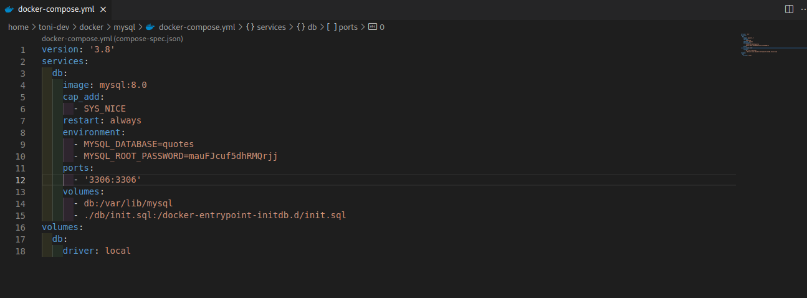
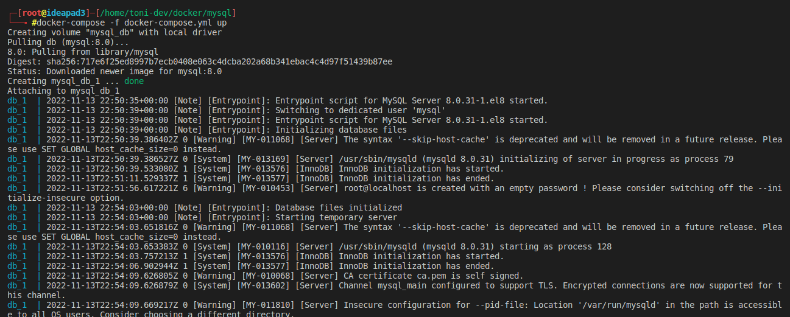
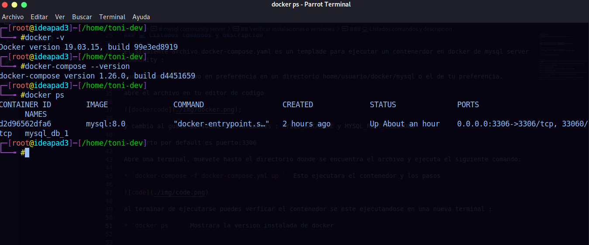
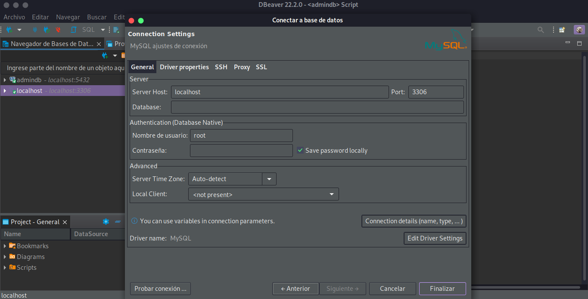
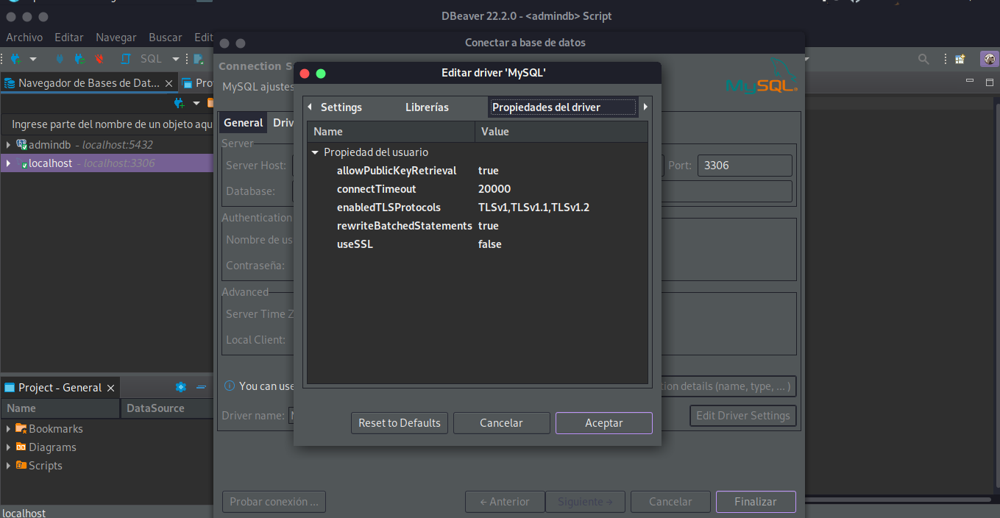
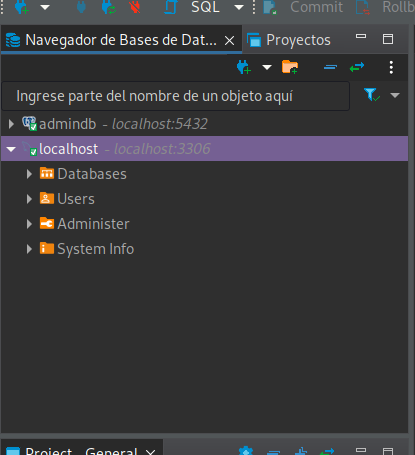

 
# mysql community server

  <h1>docker</h1>
  <strong>Este es un contendedor ejecutable con docker composer</strong> 

 

## Requisitos 

* docker [Instalar](https://www.docker.com/get-started/)
* docker compose  [Instalar](https://www.digitalocean.com/community/tutorials/how-to-install-and-use-docker-compose-on-ubuntu-20-04-es)

 

## Verificar instalaciones o versiones 

* `docker -v `    Mostrara la version instalada de docker
* `docker-compose --version`    Mostrara la version instalada de docker compose

### 🏗 Equipo: 

- [@T0ny-dev](https://github.com/T0ny-dev)

### 💻 Listados comandos y descripcion 

El siguiente archivo docker-compose.yaml es un templade para ejecutar un contenerdor en docker de mysql server community :

guardar en el archivo en preferencia en un directorio home/usuario/docker/mysql o el de tu preferencia.

abre el archivo en tu editor de codigo 

;

y cambia al gusto personal las variables : MYSQL_DATABASE y MYSQL_ROOT_PASSWORD

el puerto por default es puerto:3306

Abre una terminal, muevete hasta el directorio donde se encuentra el archivo y ejecuta el siguiente comando: 

* `docker-compose -f docker-compose.yml up `  Esto ejecutara el contenedor y los pasos 

al terminar de ejecutarse puedes verficar el contenedor se este ejecutandose en una nueva terminal : 

* `docker ps `    Mostrara los contenedores

Listo una vez hecho esto esta listo para conectarse a mysql community server

con la siguiente informacion :

user: root
password: password(docker-dompose.yaml)

Abrir el administrador de bases de datos de preferencia yo usare dbeaver: 

si se presenta un error de allow keys puedes editar las configuraciones en Edit Driver Settings/propiedades del driver y agregar con click derecho las siguientes : allowPublicKeyRetrieval:true  , useSSL:false

una vez termniado prueba la conexion a la base de datos:
 

